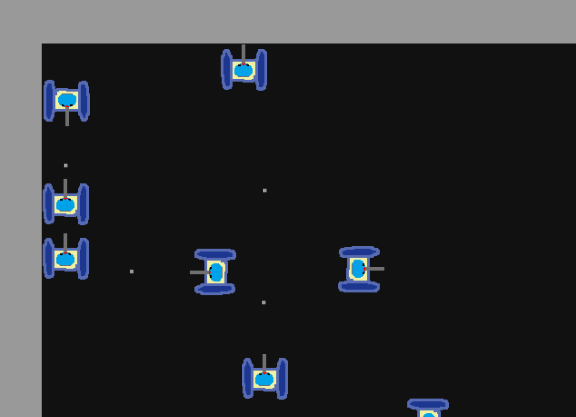

# go-tank

---
Simple multiplayer 'real-time' online game that uses _WebSockets_ and is played via browser. Also known as 'io game' type. Created with [Golang](https://go.dev/) (backend) and [JavaScript/Phaser 3](https://phaser.io/) (frontend).

[more info](#more-info)

## Getting Started
### Prerequisites
Things you need to install.
- [Golang](https://go.dev/dl/) _(tested on 1.19.3)_
- Browser that support JavaScript

### Installation and Building
1. Clone repository using command `git clone https://github.com/vytautashi/go-tank.git`
2. Run command `go build` within `/game-server` directory
3. Run command `go build` within `/game-client` directory

### Running Game
1. Run game-server executable in `/game-server` directory
2. Run game-client executable in `/game-client` directory
3. Access game using browser via url http://localhost:8081 _(open on multiple tabs to spawn multiple players)_

### Game Controls
* Movement - keyboard arrows (up, down, left, right)
* Fire gun - spacebar

## More Info
This repository demonstrates basic created 'io game' using _Golang_ and _Phaser_. Player can move and fire bullets which collides with other players. Its not blooted with a lot of functionality in order to make it simple and easy to understand.

It does have:
* Movable game characters (tanks)
* Bullets collision with players
* Communication between server and clients via _WebSockects_
* Backend uses concurrency (Golang go routines, communication via channels, non-blocking)

It does not have:
* IP restrictor _(same person from same computer can have multiple active players in game)_ **(backend)**
* Spam restrictor _(do not limit message count received from clients/players via WebSockects)_ **(backend)**
* Client-side prediction (https://en.wikipedia.org/wiki/Client-side_prediction) **(frontend)**
* Code is not performance friendly _(highly optimised code would be hard to read/understand)_
  * Now bullet objects are recreated everytime in frontend when it gets message about bullets positions from `game-server`, better would be to track bullets using id and move them accordingly instead of recreating **or/and** instead of deleting hide somewhere of the game screen and when command received, just set to correct position. **(frontend)**
  * Might be good to send only once Bullet data (position, speed, lifetime, moving direction) and let frontend calculate every next frame bullets positions, only send additional message to frontend if bullet collided with player and exploded so to remove bullet ealier from frontend. **(backend+frontend)**
  * And other places.

## Screenshots
#### Screenshot 1
